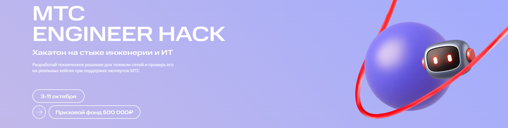

<div align="center">

  

  <h1>AI dashboards and logs monitoring</h1>

  <h3>Автоматизированный мониторинг инфраструктуры и приложений с AI</h3>

  <b>Проект выполнен в рамках хакатона “МТС Engineer Hack — DevOps”</b>

  <br /><br />

  <!-- Badges -->
  <a href="https://www.docker.com/"></a>
  <a href="https://prometheus.io/"></a>
  <a href="https://grafana.com/"></a>
  
  
  <a href="https://redis.io/"></a>
  <a href="https://www.postgresql.org/"></a>
  <a href="https://www.rabbitmq.com/"></a>
  
  

</div>

## 🧑‍💻 О проекте / About the project

- **AI Monitoring** — интеллектуальная система наблюдаемости для инфраструктуры и приложений с AI‑ассистентом. Проект собирает метрики и логи, симулирует телеком‑нагрузку и предоставляет AI‑консоль для анализа, генерации дашбордов и рекомендаций по реагированию на инциденты.
- *Решаемые проблемы:*  
  — сложность настройки мониторинга → автоматическая генерация PromQL‑запросов и Grafana‑дашбордов;  
  — долгое реагирование на инциденты → AI‑анализ алертов и логов с подсказками по устранению.

- **Почему актуально для МТС/телеком:** высокая доступность и наблюдаемость — критичны. Быстрое обнаружение и устранение проблем снижает простои и повышает качество сервиса.

## ✨ Демонстрация / Demo

- Ниже представлена демонстрация работы анализа логов и создания дашбордов:


## 🏛️ Архитектура и компоненты / Architecture & Components

- **Prometheus** — сбор и хранение метрик (порт `9090`). Конфиг: `./config/prometheus.yml`.
- **Grafana** — визуализация и дашборды (порт `3000`). Провижининг: `./grafana/provisioning`, загружаемые дашборды: `./generated_dashboards`.
- **cAdvisor** — метрики контейнеров (порт `8080`).
- **node-exporter** — системные метрики хоста (порт `9100`).
- **redis-exporter** — метрики Redis (порт `9121`).
- **Redis** — кеш/источник метрик симуляторов (порт `6379`, локальный пароль в compose: `admin123`).
- **PostgreSQL** — база данных приложения (порт `5432`, БД `telecom_db`).
- **postgres-exporter** — метрики PostgreSQL (порт `9187`).
- **RabbitMQ** — брокер сообщений для симуляторов (порты `5672`, `15672`).
- **gpt4free** — локальный AI‑сервис для генерации/анализа (доступен на `127.0.0.1:1337`).
- **telecom-simulator** — генерация событий/нагрузки; использует RabbitMQ и Redis.
- **telecom-monitoring-console** — UI интерфейс (порт `8501`), подключается к Prometheus/Grafana и локальному gpt4free.

## 🛠️ Технологический стек / Tech Stack

- **Инфраструктура:** Docker, `docker-compose v3.8`
- **Мониторинг:** Prometheus, Grafana
- **AI/LLM:** локальный сервис gpt4free для анализа и генерации дашбордов/рекомендаций

## 🚀 Быстрый старт / Quick Start

### Требования / Requirements
- Установленные Docker и docker‑compose
- Ресурсы: минимум 4 GB RAM и 4 CPU

### Установка и запуск / Setup & Run
1) Клонируйте репозиторий:
```bash
git clone ...
```

2) Перейдите в директорию проекта:
```bash
cd /path/to/...
```

3) Запустите стек мониторинга и симуляции:
```bash
docker-compose up -d --build
```

- Эта команда соберёт образы (там, где указан `build`) и поднимет все сервисы.

### Проверка доступности / Health Check
- Интерфейс: http://localhost:8501
- Grafana: http://localhost:3000 (логин/пароль по умолчанию: `admin/admin`)
- Prometheus: http://localhost:9090

## 📊 Дашборды и эндпоинты / Dashboards & Endpoints

- Grafana: http://localhost:3000 (admin/admin)
- Prometheus: http://localhost:9090
- cAdvisor: http://localhost:8080
- Postgres Exporter: http://localhost:9187
- Node Exporter: http://localhost:9100
- Redis Exporter: http://localhost:9121
- RabbitMQ Management: http://localhost:15672 (admin / `admin123`)

## 🤖 Использование AI и LLM / AI & LLM Usage

- Включён локальный сервис **gpt4free** (контейнер `g4f`), к которому обращается `...`.
- Применения:
  - автоматический анализ метрик и алертов,
  - помощь в отладке и расследовании инцидентов,
  - генерация PromQL‑запросов и Grafana‑дашбордов,
  - рекомендации по устранению проблем на основе логов и временных корреляций.

## 🧪 Применение в МТС/Телеком / Telecom Use‑Cases

- Автоматизация развёртывания и мониторинга VNFs/5G‑сервисов.
- CI/CD‑наблюдаемость для BSS/OSS.
- Инструментация мобильных бэкенд‑сервисов.
- Лабораторное тестирование и симуляция нагрузки.

Ожидаемые эффекты:
- ускорение деплоя,
- сокращение времени расследования инцидентов,
- экономия за счёт автоматизации рутинных операций.

## 📂 Структура проекта / Project Structure

```
Project
├── Dockerfile
├── alerts
│   └── telecom_alerts.yaml
├── chroma_db
│   └── chroma.sqlite3
├── config
│   └── prometheus.yml
├── docker-compose.yaml
├── grafana
│   └── provisioning
│       ├── dashboards
│       │   └── dashboard.yml
│       └── datasources
│           └── prometheus.yml
├── handlers
│   ├── gpt4free_handler.py
│   ├── grafana_handler.py
│   ├── postgres_handler.py
│   ├── prometheus_handler.py
│   ├── rabbitmq_handler.py
│   └── vectordb_handler.py
├── main.py
├── requirements.txt
└── simulators
    ├── Dockerfile
    ├── requirements.txt
    └── telecom_data_simulator.py
```

## 📑 Лицензия / License

- MIT License. См. файл `LICENSE`.

---

<div align="center">

⭐ Если проект вам полезен — поддержите звёздой! / If you find it useful, please give it a star! ⭐

</div>